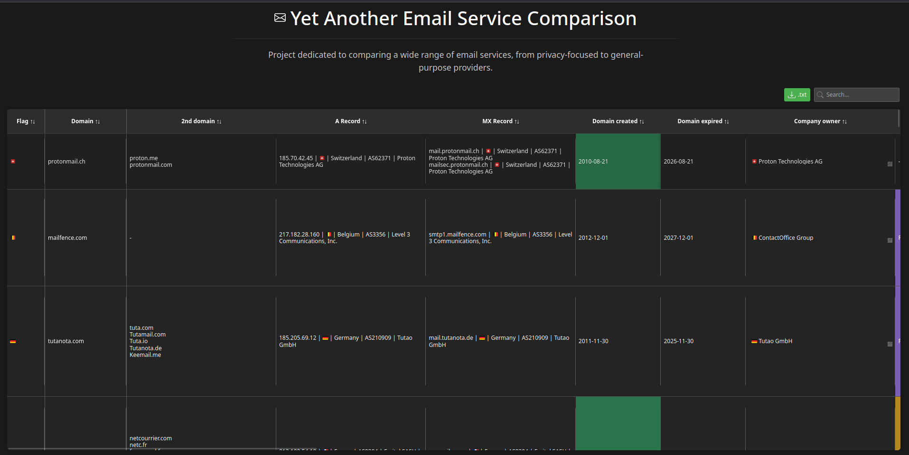
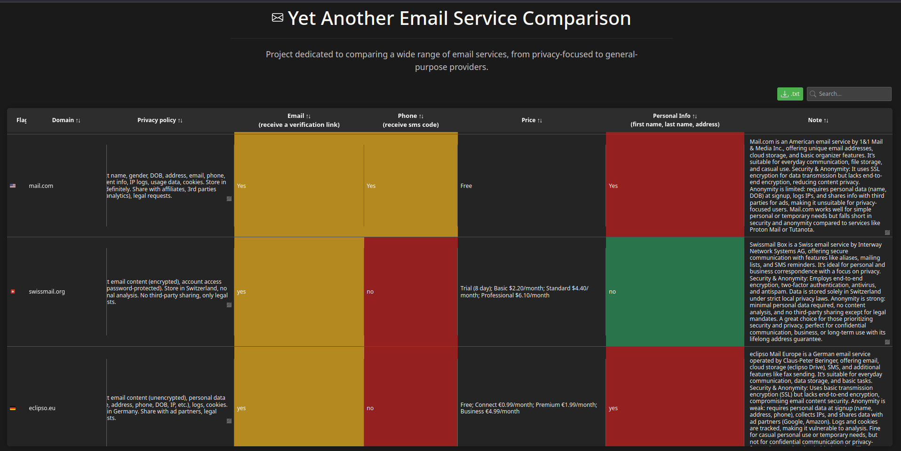

# 📬 Yet Another Email Service Comparison


## 🌐 Overview

**Yet Another Email Service Comparison** - is a project dedicated to comparing a wide range of email services, from privacy-focused to general-purpose providers. <br>
Built with HTML, CSS, JavaScript, Bootstrap, data stored in `data.json`. <br>

Inspired by [**@Lissy93**](https://github.com/Lissy93) her repo [**email-comparison**](https://github.com/Lissy93/email-comparison). <br>
Based on [**httpsmail.com**](https://www.httpsmail.com/mail/). <br>
Some info taken from  [**Offshore-CAT**](https://offshore.cat/email.php). <br>


🔗 **web**: [**cyberanchor.github.io**](https://cyberanchor.github.io/eMailCompare/web)

## 📊 Features

- **Interactive table**: displays email provider details (e.g., domain, jurisdiction, encryption).
- **Search & sort**: filter and sort services by keywords or columns.
- **Data export**: download email domains as a `.txt` file.
- **Color-coded insights**: highlights green, red, etc...

## 🔍 Comparison criteria

Email services are evaluated based on the following criteria (all data collected from public source):

- **Security**: presence of end-to-end encryption, SSL/TLS.
- **Privacy**: data collection practices, IP logging, third-party sharing, and personal information requirements (e.g., name, address).
- **Jurisdiction**: server location and applicable privacy laws (e.g., Swiss privacy, GDPR).
- **Intelligence alliance**: affiliation with surveillance networks (e.g., Five Eyes, Fourteen Eyes).
- **Registration requirements**: need for email or phone verification during account setup.
- **Pricing**: availability of free tiers and costs of premium plans.
- **Terms of Service (ToS)**: usage restrictions, such as prohibitions on spam, hacking, or commercial activities.
- **Infrastructure**: A/MX records, server hosting provider, and company ownership.
- **Domain details**: Primary and secondary domains, creation, and expiration dates.


---


## ✅ Verified email services

In this table, email services were personally verified by me [**@cyberanchor**](https://github.com/cyberanchor). <br>
Accounts were registered on each email service, and manual tests were conducted across various parameters to confirm their privacy, security, and functionality.

| Checked | Domain            | Flag |
|--------|-------------------|------|
| ✅      | protonmail.ch     | 🇨🇭   |
| ✅      | mailfence.com     | 🇧🇪   |
| ✅      | tutanota.com      | 🇩🇪   |
| ✅      | mailo.com         | 🇫🇷   |
| ✅      | mail.com          | 🇺🇸   |
| ✅      | swissmail.org     | 🇨🇭   |
| ✅      | eclipso.eu        | 🇩🇪   |
| ✅      | skymail.de        | 🇩🇪   |
| ✅      | firemail.de       | 🇩🇪   |
| ✅      | emailn.de         | 🇩🇪   |
| ✅      | inbox.eu          | 🇱🇻   |
| ✅      | woelklimail.com   | 🇨🇭   |
| ✅      | interia.pl        | 🇵🇱   |
| ✅      | int.pl            | 🇵🇱   |
| ✅      | onet.pl           | 🇵🇱   |
| ✅      | datamail.in       | 🇮🇳   |
| ✅      | topmail.kz        | 🇰🇿   |
| ✅      | mail.az           | 🇦🇿   |
| ✅      | amail.az          | 🇦🇿   |
| ✅      | dmail.ai          | 🇸🇬   |
| ✅      | mailchain.com     | 🇬🇧   |
| ✅      | ledgermail.io     | 🇦🇪   |
| ✅      | onionmail.org     | 🇺🇸   | 
| ✅      | privatemx.org     | ❓    |
| ✅      | dnmx.su           | ❓    |
| ✅      | xmail.net         | 🇧🇸   |
| ✅      | monocles.de       | 🇩🇪   |
| ✅      | atomicmail.io     | 🇪🇪   |
| ✅      | mail.io           | 🇭🇷   |
| ✅      | mailum.com        | ❓    |
| ✅      | codamail.com      | 🇺🇸   |
| ✅      | offilive.com      | 🇫🇮   |
| ✅      | contactoffice.com | 🇧🇪   |
| ✅      | fbm-mail.com      | 🇷🇺   |
| ✅      | isellemails.com   | 🇺🇸   |
| ✅      | disroot.org       | 🇳🇱   |
| ✅      | autistici.org     | 🇮🇹   |
| ✅      | dmz.rs            | 🇷🇸   |


---


## ❓ Unverified email services

These services are pending verification.

| Checked | Domain               | Flag |
|--------|----------------------|------|
| ❌      | enbox.me             | ❓    |
| ❌      | otso.city            | ❓    |
| ❌      | nextmail.app         | ❓    |
| ❌      | mailsect.com         | ❓    |
| ❌      | rapidmail.io         | ❓    |
| ❌      | efind.com            | ❓    |
| ❌      | transcom.net         | ❓    |
| ❌      | fastemail.io         | ❓    |
| ❌      | fmail.net            | ❓    |
| ❌      | emailsecure.org      | ❓    |
| ❌      | mailtomb.com         | ❓    |
| ❌      | fortressinbox.com    | ❓    |
| ❌      | mailsea.top          | ❓    |
| ❌      | eprivatemail.com     | ❓    |
| ❌      | purelyemail.com      | ❓    |
| ❌      | r7mail.com           | ❓    |
| ❌      | emailkite.com        | ❓    |
| ❌      | aivmail.com          | ❓    |
| ❌      | homemail.info        | ❓    |
| ❌      | privi.email          | ❓    |
| ❌      | anonmails.de         | ❓    |
| ❌      | zebramailbox.com     | ❓    |
| ❌      | eppie.io             | ❓    |
| ❌      | fabmail.org          | ❓    |
| ❌      | maimail.org          | ❓    |
| ❌      | securemail.opentext.com | ❓ |
| ❌      | mrmail.com           | ❓    |
| ❌      | cock.li              | ❓    |
| ❌      | beemail.space        | ❓    |
| ❌      | black.com            | ❓    |
| ❌      | encrypted.com        | ❓    |
| ❌      | dds.nl               | ❓    |
| ❌      | portugalmail.pt      | ❓    |
| ❌      | mail.sapo.pt         | ❓    |
| ❌      | mail-online.dk       | ❓    |
| ❌      | mailme.dk            | ❓    |
| ❌      | email.is             | ❓    |
| ❌      | mailbox.gr           | ❓    |
| ❌      | vip.gr               | ❓    |
| ❌      | blindzeln.org        | ❓    |
| ❌      | undernet.uy          | ❓    |
| ❌      | dismail.de           | ❓    |
| ❌      | espiv.net            | ❓    |
| ❌      | freenet.de           | ❓    |
| ❌      | nubo.coop            | ❓    |
| ❌      | tiscali.it           | ❓    |
| ❌      | netaddress.com       | ❓    |
| ❌      | rediff.com           | ❓    |
| ❌      | danwin1210.de        | ❓    |
| ❌      | webmail.com.my       | ❓    |
| ❌      | webmail.se           | ❓    |
| ❌      | indamail.hu          | ❓    |
| ❌      | webmail.fps.de       | ❓    |
| ❌      | webmail.com.pt       | ❓    |
| ❌      | inbox.com            | ❓    |
| ❌      | mail.world           | ❓    |
| ❌      | inleed.xyz           | ❓    |
| ❌      | mutantmail.com       | ❓    |
| ❌      | aikq.de              | ❓    |
| ❌      | pissmail.com         | ❓    |
| ❌      | beeble.com           | ❓    |
| ❌      | murena.io            | ❓    |
| ❌      | plummail.co          | ❓    |
| ❌      | confidesk.com        | ❓    |
| ❌      | lockrmail.com        | ❓    |
| ❌      | esiliati.org         | ❓    |
| ❌      | iobox.com            | ❓    |
| ❌      | riotcat.org          | ❓    |
| ❌      | aangat.lahat.computer| ❓    |
| ❌      | net.hr               | ❓    |
| ❌      | libero.it            | ❓    |
| ❌      | macaw.me             | ❓    |
| ❌      | hot-chilli.eu        | ❓    |
| ❌      | darkn.space          | ❓    |
| ❌      | tildeverse.org       | ❓    |
| ❌      | vern.cc              | ❓    |
| ❌      | tilde.team           | ❓    |
| ❌      | ctrl-c.club          | ❓    |
| ❌      | secria.me            | ❓    |
| ❌      | dmail.earth          | ❓    |
| ❌      | 0.email          | ❓    |
| ❌      | hey.com          | ❓    |
| ❌      | paxmail.cc          | ❓    |
| ❌      | soverin.com          | ❓    |
| ❌      | vfemail.net          | ❓    |
| ❌      | memail.com          | ❓    |
| ❌      | tildamail.com          | ❓    |
| ❌      | safe-mail.net          | ❓    |
| ❌      | yaanimail.com          | ❓    |
| ❌      | hrzn.cool          | ❓    |
| ❌      | atfix.net          | ❓    |
| ❌      | anpa.de          | ❓    |
| ❌      | 5x2.de          | ❓    |
| ❌      | webmail.schokokeks.org          | ❓    |
| ❌      | ok.de          | ❓    |
| ❌      | directbox.com          | ❓    |
| ❌      | mailjunky.net          | ❓    |
| ❌      | emailn.de          | ❓    |
| ❌      | tchncs.de          | ❓    |
| ❌      | fuck.it          | ❓    |
| ❌      | uq.ci          | ❓    |
| ❌      | xmr.email          | ❓    |
| ❌      | noleron.com          | ❓    |
| ❌      | inboxia.org          | ❓    |
| ❌      | erine.email          | ❓    |
| ❌      | actiu.info          | ❓    |
| ❌      | aktivix.org          | ❓    |
| ❌      | anarchyplanet.org          | ❓    |
| ❌      | artikel-140.nl          | ❓    |
| ❌      | boum.org          | ❓    |
| ❌      | codigosur.org          | ❓    |
| ❌      | colnodo.apc.org          | ❓    |
| ❌      | cryptix.de          | ❓    |
| ❌      | ecn.org          | ❓    |
| ❌      | entodaspartes.org          | ❓    |
| ❌      | espora.org          | ❓    |
| ❌      | flag.blackened.net          | ❓    |
| ❌      | gleducar.org.ar          | ❓    |
| ❌      | greennet.org.uk          | ❓    |
| ❌      | guardachuva.org          | ❓    |
| ❌      | guifi.net          | ❓    |
| ❌      | hackbloc.org          | ❓    |
| ❌      | immerda.ch          | ❓    |
| ❌      | indivia.net          | ❓    |
| ❌      | inventati.org          | ❓    |
| ❌      | kemit.net          | ❓    |
| ❌      | koumbit.org          | ❓    |
| ❌      | lautre.net          | ❓    |
| ❌      | mail.coop          | ❓    |
| ❌      | mayfirst.org          | ❓    |
| ❌      | nadir.org          | ❓    |
| ❌      | netux.org          | ❓    |
| ❌      | noblogs.org          | ❓    |
| ❌      | nodo50.net          | ❓    |
| ❌      | nolog.cz          | ❓    |
| ❌      | no-log.org          | ❓    |
| ❌      | pangea.org          | ❓    |
| ❌      | resist.ca          | ❓    |
| ❌      | sarava.org          | ❓    |
| ❌      | shelter.is          | ❓    |
| ❌      | sindominio.net          | ❓    |
| ❌      | snopyta.org          | ❓    |
| ❌      | so36.net          | ❓    |
| ❌      | squat.net          | ❓    |
| ❌      | systemausfall.org          | ❓    |
| ❌      | systemli.org          | ❓    |
| ❌      | systerserver.net          | ❓    |


## 💻 Installation

1. **Clone the repository**:
   ```bash
   git clone https://github.com/cyberanchor/eMailCompare
   cd eMailCompare/web
   ```

2. **Run locally**:
   ```bash
   sudo npm install -g http-server
   http-server .
   ```
   Access at `http://localhost:8080`.

## 📸 Screenshots

<div style="text-align: center;">
  
</div>


<div style="text-align: center;">
  
</div>

## 📂 Data storage

All email service data is stored in `data.json`, enabling easy updates and contributions. Each entry includes fields like domain, jurisdiction, and privacy policies, with a `color` field to customize cell colors in the interactive table. 

**Example JSON structure**: 
```json
[
  {
    "flag": {
      "value": "🇨🇭",
      "color": "none"
    },
    "Domain": {
      "value": "protonmail.ch",
      "color": "none"
    },
    "2nd domain": {
      "value": "proton.me\nprotonmail.com",
      "color": "none"
    },
    "A Record": {
      "value": "185.70.42.45 | 🇨🇭 | Switzerland | AS62371 | Proton Technologies AG",
      "color": "none"
    },
    "MX Record": {
      "value": "mail.protonmail.ch | 🇨🇭 | Switzerland | AS62371 | Proton Technologies AG\nmailsec.protonmail.ch | 🇨🇭 | Switzerland | AS62371 | Proton Technologies AG",
      "color": "none"
    },
    "Domain crated": {
      "value": "2010-08-21",
      "color": "green"
    },
    "Domain expired": {
      "value": "2026-08-21",
      "color": "none"
    },
    "Company owner": {
      "value": "🇨🇭 Proton Technologies AG",
      "color": "none"
    },
    "Intelligence Alliance": {
      "value": null,
      "color": "none"
    },
    "Jurisdiction (based on server location)": {
      "value": "Switzerland",
      "color": "none"
    },
    "Site description": {
      "value": "Proton Mail: Get a private, secure, and encrypted email account\nProton Mail is the world’s largest secure email service with, \nOver 100 million users.\nAvailable on Web, iOS, Android, and desktop.\nProtected by Swiss privacy law.",
      "color": "none"
    },
    "ToS": {
      "value": "Illegal actions (CSAM, spam, hacking), IP violation, insults, self-referrals, fraud\nCollect per Privacy Policy, store without guarantees, delete inactive accounts (12 mos.), share upon authorities' request",
      "color": "none"
    },
    "Privacy policy": {
      "value": "Collect per Privacy Policy, store without guarantees, delete inactive accounts (12 mos.), share upon authorities' request",
      "color": "none"
    },
    "Email(receive a verification link)": {
      "value": "yes",
      "color": "yellow"
    },
    "Phone(receive s sms code)": {
      "value": "optional",
      "color": "green"
    },
    "Price": {
      "value": "free; Unlimited $9.99/month",
      "color": "none"
    },
    "Personal Info(first name, last name, adress, etc..)": {
      "value": "yes",
      "color": "red"
    },
    "Note": {
      "value": "Proton Mail is a secure email service with end-to-end encryption, created by the Swiss company Proton AG. It is suitable for registering on various services, collects user information, and shares data with authorities. For registration, it is recommended to use anti-detect browsers and clean mobile proxies.",
      "color": "none"
    }
  }
]
```


## 🤝 Contributing

We value your feedback to enhance our data!
- [GitHub Issues](https://github.com/cyberanchor/eMailCompare/issues).


---

## 💸 Donations & contacts
  
📬 **Email**: `cyberanchor@krutt.org` <br>
🔑 **Keybase**: [`@cyberanchor`](https://keybase.io/cyberanchor) <br>
🔒 **PGP Fingerprint**: `269E CB79 6CF5 31CB 3963  EC50 4F5A F4E9 F43B B1D2` <br>
💸 **Bitcoin**: `bc1qtnc0v6n2azzufd7ksuwm6yre6fjcc8z030xfud` <br>


## 📜 License

If you use data or reference this project, please credit [**this repo**](https://github.com/cyberanchor/eMailCompare).
