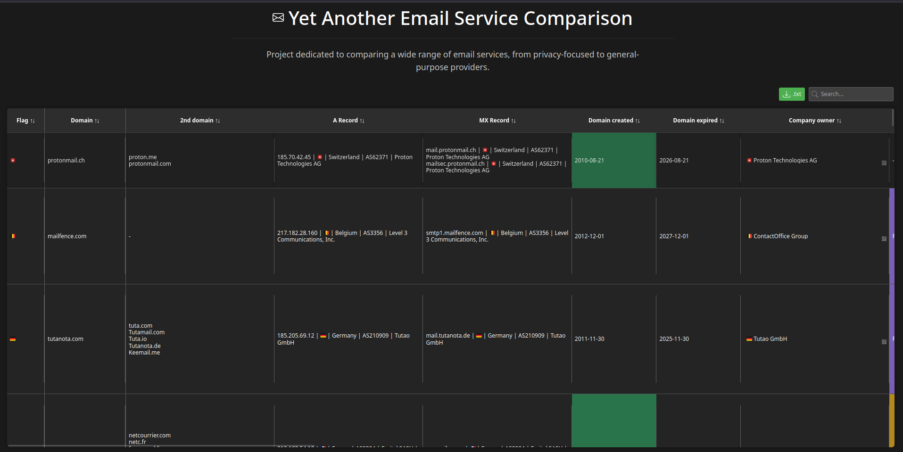
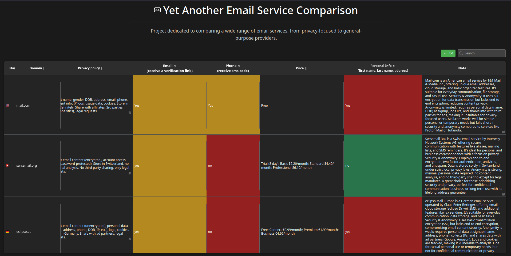

<div align="center">
   
</img>
<h1> Yet Another Email Service Comparison </h1>


🔗 <a href="https://cyberanchor.github.io/eMailCompare/web"><b>demo web</b></a> 

</div>


## Overview

**Yet Another Email Service Comparison** - is a project dedicated to comparing a wide range of email service providers, from privacy-focused solutions to general-purpose platforms.

The project is built using **HTML, CSS, JavaScript, and Bootstrap**, with all structured data stored in `data.json`.

### Key Features

- **Interactive comparison table** displaying provider details such as domains, jurisdiction, and encryption support
- **Search and sorting functionality** to filter services by keywords or table columns
- **Data export** allowing email domains to be downloaded as a `.txt` file
- **Color-coded indicators** (green, red, etc.) for quick visual insights

### References & Inspiration

- Inspired by **[@Lissy93](https://github.com/Lissy93)** and her repository **[email-comparison](https://github.com/Lissy93/email-comparison)**
- Based on **[httpsmail.com](https://www.httpsmail.com/mail/)** of **[@steley](https://github.com/steley)**
- Additional information sourced from **[Offshore-CAT](https://offshore.cat/?page=email)**
- Related resource: **[dismail.de](https://dismail.de/serverlist.html)**
- Some sourced from: **[link-base.ms](https://link-base.ms/useful)**


## Comparison criteria

Email services are evaluated based on the following criteria (all data collected from public source):

- **Security**: presence of end-to-end encryption, SSL/TLS.
- **Privacy**: data collection practices, IP logging, third-party sharing, and personal information requirements (e.g., name, address).
- **Jurisdiction**: server location and applicable privacy laws (e.g., Swiss privacy, GDPR).
- **Intelligence alliance**: affiliation with surveillance networks (e.g., Five Eyes, Fourteen Eyes).
- **Registration requirements**: need for email or phone verification during account setup.
- **Pricing**: availability of free tiers and costs of premium plans.
- **Terms of Service (ToS)**: usage restrictions, such as prohibitions on spam, hacking, or commercial activities.
- **Infrastructure**: A/MX records, server hosting provider, and company ownership.
- **Domain details**: Primary and secondary domains, creation, and expiration dates.

## Screenshots

<div style="text-align: center;">
  
</div>


<div style="text-align: center;">
  
</div>


## ✅ Checked email services
Accounts were manually registered on each email service, followed by controlled testing across defined privacy, security, and functionality criteria.

| Checked | Domain            | Flag |
|--------|-------------------|------|
| ✅      | protonmail.ch     | 🇨🇭   |
| ✅      | mailfence.com     | 🇧🇪   |
| ✅      | tutanota.com      | 🇩🇪   |
| ✅      | mailo.com         | 🇫🇷   |
| ✅      | mail.com          | 🇺🇸   |
| ✅      | swissmail.org     | 🇨🇭   |
| ✅      | eclipso.eu        | 🇩🇪   |
| ✅      | skymail.de        | 🇩🇪   |
| ✅      | firemail.de       | 🇩🇪   |
| ✅      | emailn.de         | 🇩🇪   |
| ✅      | inbox.eu          | 🇱🇻   |
| ✅      | woelklimail.com   | 🇨🇭   |
| ✅      | interia.pl        | 🇵🇱   |
| ✅      | int.pl            | 🇵🇱   |
| ✅      | onet.pl           | 🇵🇱   |
| ✅      | datamail.in       | 🇮🇳   |
| ✅      | topmail.kz        | 🇰🇿   |
| ✅      | mail.az           | 🇦🇿   |
| ✅      | amail.az          | 🇦🇿   |
| ✅      | dmail.ai          | 🇸🇬   |
| ✅      | mailchain.com     | 🇬🇧   |
| ✅      | ledgermail.io     | 🇦🇪   |
| ✅      | onionmail.org     | 🇺🇸   | 
| ✅      | privatemx.org     | ❓    |
| ✅      | dnmx.su           | ❓    |
| ✅      | xmail.net         | 🇧🇸   |
| ✅      | monocles.de       | 🇩🇪   |
| ✅      | atomicmail.io     | 🇪🇪   |
| ✅      | mail.io           | 🇭🇷   |
| ✅      | mailum.com        | ❓    |
| ✅      | codamail.com      | 🇺🇸   |
| ✅      | offilive.com      | 🇫🇮   |
| ✅      | contactoffice.com | 🇧🇪   |
| ✅      | fbm-mail.com      | 🇷🇺   |
| ✅      | isellemails.com   | 🇺🇸   |
| ✅      | disroot.org       | 🇳🇱   |
| ✅      | autistici.org     | 🇮🇹   |
| ✅      | dmz.rs            | 🇷🇸   |


## ❓ Pending email services
Email services awaiting manual account registration and subsequent testing.

| Checked | Domain               | Flag |
|--------|----------------------|------|
| ❌      | enbox.me             | ❓    |
| ❌      | otso.city            | ❓    |
| ❌      | nextmail.app         | ❓    |
| ❌      | mailsect.com         | ❓    |
| ❌      | rapidmail.io         | ❓    |
| ❌      | efind.com            | ❓    |
| ❌      | transcom.net         | ❓    |
| ❌      | fastemail.io         | ❓    |
| ❌      | fmail.net            | ❓    |
| ❌      | emailsecure.org      | ❓    |
| ❌      | mailtomb.com         | ❓    |
| ❌      | fortressinbox.com    | ❓    |
| ❌      | mailsea.top          | ❓    |
| ❌      | eprivatemail.com     | ❓    |
| ❌      | purelyemail.com      | ❓    |
| ❌      | r7mail.com           | ❓    |
| ❌      | emailkite.com        | ❓    |
| ❌      | aivmail.com          | ❓    |
| ❌      | homemail.info        | ❓    |
| ❌      | privi.email          | ❓    |
| ❌      | anonmails.de         | ❓    |
| ❌      | zebramailbox.com     | ❓    |
| ❌      | eppie.io             | ❓    |
| ❌      | fabmail.org          | ❓    |
| ❌      | maimail.org          | ❓    |
| ❌      | securemail.opentext.com | ❓ |
| ❌      | mrmail.com           | ❓    |
| ❌      | cock.li              | ❓    |
| ❌      | beemail.space        | ❓    |
| ❌      | black.com            | ❓    |
| ❌      | encrypted.com        | ❓    |
| ❌      | dds.nl               | ❓    |
| ❌      | portugalmail.pt      | ❓    |
| ❌      | mail.sapo.pt         | ❓    |
| ❌      | mail-online.dk       | ❓    |
| ❌      | mailme.dk            | ❓    |
| ❌      | email.is             | ❓    |
| ❌      | mailbox.gr           | ❓    |
| ❌      | vip.gr               | ❓    |
| ❌      | blindzeln.org        | ❓    |
| ❌      | undernet.uy          | ❓    |
| ❌      | dismail.de           | ❓    |
| ❌      | espiv.net            | ❓    |
| ❌      | freenet.de           | ❓    |
| ❌      | nubo.coop            | ❓    |
| ❌      | tiscali.it           | ❓    |
| ❌      | netaddress.com       | ❓    |
| ❌      | rediff.com           | ❓    |
| ❌      | danwin1210.de        | ❓    |
| ❌      | webmail.com.my       | ❓    |
| ❌      | webmail.se           | ❓    |
| ❌      | indamail.hu          | ❓    |
| ❌      | webmail.fps.de       | ❓    |
| ❌      | webmail.com.pt       | ❓    |
| ❌      | inbox.com            | ❓    |
| ❌      | mail.world           | ❓    |
| ❌      | inleed.xyz           | ❓    |
| ❌      | mutantmail.com       | ❓    |
| ❌      | aikq.de              | ❓    |
| ❌      | pissmail.com         | ❓    |
| ❌      | beeble.com           | ❓    |
| ❌      | murena.io            | ❓    |
| ❌      | plummail.co          | ❓    |
| ❌      | confidesk.com        | ❓    |
| ❌      | lockrmail.com        | ❓    |
| ❌      | esiliati.org         | ❓    |
| ❌      | iobox.com            | ❓    |
| ❌      | riotcat.org          | ❓    |
| ❌      | aangat.lahat.computer| ❓    |
| ❌      | net.hr               | ❓    |
| ❌      | libero.it            | ❓    |
| ❌      | macaw.me             | ❓    |
| ❌      | hot-chilli.eu        | ❓    |
| ❌      | darkn.space          | ❓    |
| ❌      | tildeverse.org       | ❓    |
| ❌      | vern.cc              | ❓    |
| ❌      | tilde.team           | ❓    |
| ❌      | ctrl-c.club          | ❓    |
| ❌      | secria.me            | ❓    |
| ❌      | dmail.earth          | ❓    |
| ❌      | 0.email          | ❓    |
| ❌      | hey.com          | ❓    |
| ❌      | paxmail.cc          | ❓    |
| ❌      | soverin.com          | ❓    |
| ❌      | vfemail.net          | ❓    |
| ❌      | memail.com          | ❓    |
| ❌      | tildamail.com          | ❓    |
| ❌      | safe-mail.net          | ❓    |
| ❌      | yaanimail.com          | ❓    |
| ❌      | hrzn.cool          | ❓    |
| ❌      | atfix.net          | ❓    |
| ❌      | anpa.de          | ❓    |
| ❌      | 5x2.de          | ❓    |
| ❌      | webmail.schokokeks.org          | ❓    |
| ❌      | ok.de          | ❓    |
| ❌      | directbox.com          | ❓    |
| ❌      | mailjunky.net          | ❓    |
| ❌      | emailn.de          | ❓    |
| ❌      | tchncs.de          | ❓    |
| ❌      | fuck.it          | ❓    |
| ❌      | uq.ci          | ❓    |
| ❌      | xmr.email          | ❓    |
| ❌      | noleron.com          | ❓    |
| ❌      | inboxia.org          | ❓    |
| ❌      | erine.email          | ❓    |
| ❌      | actiu.info          | ❓    |
| ❌      | aktivix.org          | ❓    |
| ❌      | anarchyplanet.org          | ❓    |
| ❌      | artikel-140.nl          | ❓    |
| ❌      | boum.org          | ❓    |
| ❌      | codigosur.org          | ❓    |
| ❌      | colnodo.apc.org          | ❓    |
| ❌      | cryptix.de          | ❓    |
| ❌      | ecn.org          | ❓    |
| ❌      | entodaspartes.org          | ❓    |
| ❌      | espora.org          | ❓    |
| ❌      | flag.blackened.net          | ❓    |
| ❌      | gleducar.org.ar          | ❓    |
| ❌      | greennet.org.uk          | ❓    |
| ❌      | guardachuva.org          | ❓    |
| ❌      | guifi.net          | ❓    |
| ❌      | hackbloc.org          | ❓    |
| ❌      | immerda.ch          | ❓    |
| ❌      | indivia.net          | ❓    |
| ❌      | inventati.org          | ❓    |
| ❌      | kemit.net          | ❓    |
| ❌      | koumbit.org          | ❓    |
| ❌      | lautre.net          | ❓    |
| ❌      | mail.coop          | ❓    |
| ❌      | mayfirst.org          | ❓    |
| ❌      | nadir.org          | ❓    |
| ❌      | netux.org          | ❓    |
| ❌      | noblogs.org          | ❓    |
| ❌      | nodo50.net          | ❓    |
| ❌      | nolog.cz          | ❓    |
| ❌      | no-log.org          | ❓    |
| ❌      | pangea.org          | ❓    |
| ❌      | resist.ca          | ❓    |
| ❌      | sarava.org          | ❓    |
| ❌      | shelter.is          | ❓    |
| ❌      | sindominio.net          | ❓    |
| ❌      | snopyta.org          | ❓    |
| ❌      | so36.net          | ❓    |
| ❌      | squat.net          | ❓    |
| ❌      | systemausfall.org          | ❓    |
| ❌      | systemli.org          | ❓    |
| ❌      | systerserver.net          | ❓    |
| ❌      | walla.co.il          | ❓    |
| ❌      | envs.net          | ❓    |
| ❌      | z.org          | ❓    |
| ❌      | tiscali.cz         | ❓    |
| ❌      | mailhaven.su         | ❓    |
| ❌      | skymail.ink         | ❓    |
| ❌      | simplemail.co.in       | ❓    |
| ❌      | xyamail.com       | ❓    |
| ❌      | anarchyplanet.org      | ❓    |
| ❌      | northmail.ca      | ❓    |
| ❌      | cc.cc      | ❓    |
| ❌      | slashmail.org    | ❓    |
| ❌      | dismail.de    | ❓    |
| ❌      | exulan.com.au    | ❓    |
| ❌      | xiala.net    | ❓    |
| ❌      | tachanka.org    | ❓    |
| ❌      | potager.org    | ❓    |
| ❌      | gresille.org    | ❓    |
| ❌      | sdf.org    | ❓    |
| ❌      | 1net.gr    | ❓    |
| ❌      | paranoid.email    | ❓    |
| ❌      | coletivos.org    | ❓    |
| ❌      | openmbox.net    | ❓    |
| ❌      | overmail.de    | ❓    |
| ❌      | eumx.net    | ❓    |
| ❌      | speedmail.se    | ❓    |
| ❌      | whor.email    | ❓    |
| ❌      | elyria.cc    | ❓    |
| ❌      | morke.org    | ❓    |
| ❌      | navi.land    | ❓    |
| ❌      | nix.to    | ❓    |


<!--
## 💻 Installation

1. **Clone the repository**:
   ```bash
   git clone https://github.com/cyberanchor/eMailCompare
   cd eMailCompare/web
   ```

2. **Run locally**:
   ```bash
   sudo npm install -g http-server
   http-server .
   ```
   Access at `http://localhost:8080`.
-->


## Data storage

All email service data is stored in `data.json`. Each entry includes fields like domain, jurisdiction, and privacy policies, with a `color` field to customize cell colors in the interactive table. 

**JSON example:**
```json
[
  {
    "flag": {
      "value": "🇨🇭",
      "color": "none"
    },
    "Domain": {
      "value": "protonmail.ch",
      "color": "none"
    },
    "2nd domain": {
      "value": "proton.me\nprotonmail.com",
      "color": "none"
    },
    "A Record": {
      "value": "185.70.42.45 | 🇨🇭 | Switzerland | AS62371 | Proton Technologies AG",
      "color": "none"
    },
    "MX Record": {
      "value": "mail.protonmail.ch | 🇨🇭 | Switzerland | AS62371 | Proton Technologies AG\nmailsec.protonmail.ch | 🇨🇭 | Switzerland | AS62371 | Proton Technologies AG",
      "color": "none"
    },
    "Domain crated": {
      "value": "2010-08-21",
      "color": "green"
    },
    "Domain expired": {
      "value": "2026-08-21",
      "color": "none"
    },
    "Company owner": {
      "value": "🇨🇭 Proton Technologies AG",
      "color": "none"
    },
    "Intelligence Alliance": {
      "value": null,
      "color": "none"
    },
    "Jurisdiction (based on server location)": {
      "value": "Switzerland",
      "color": "none"
    },
    "Site description": {
      "value": "Proton Mail: Get a private, secure, and encrypted email account\nProton Mail is the world’s largest secure email service with, \nOver 100 million users.\nAvailable on Web, iOS, Android, and desktop.\nProtected by Swiss privacy law.",
      "color": "none"
    },
    "ToS": {
      "value": "Illegal actions (CSAM, spam, hacking), IP violation, insults, self-referrals, fraud\nCollect per Privacy Policy, store without guarantees, delete inactive accounts (12 mos.), share upon authorities' request",
      "color": "none"
    },
    "Privacy policy": {
      "value": "Collect per Privacy Policy, store without guarantees, delete inactive accounts (12 mos.), share upon authorities' request",
      "color": "none"
    },
    "Email(receive a verification link)": {
      "value": "yes",
      "color": "yellow"
    },
    "Phone(receive s sms code)": {
      "value": "optional",
      "color": "green"
    },
    "Price": {
      "value": "free; Unlimited $9.99/month",
      "color": "none"
    },
    "Personal Info(first name, last name, adress, etc..)": {
      "value": "yes",
      "color": "red"
    },
    "Note": {
      "value": "Proton Mail is a secure email service with end-to-end encryption, created by the Swiss company Proton AG. It is suitable for registering on various services, collects user information, and shares data with authorities. For registration, it is recommended to use anti-detect browsers and clean mobile proxies.",
      "color": "none"
    }
  }
]
```

## Contributing

Suggestions and contributions are welcome in [Issues](https://github.com/cyberanchor/eMailCompare/issues).

## Contributors

<a href="https://github.com/cyberanchor/eMailCompare/graphs/contributors">
  
</a>

## Star History

[](https://www.star-history.com/#cyberanchor/eMailCompare&type=date&legend=bottom-right)
